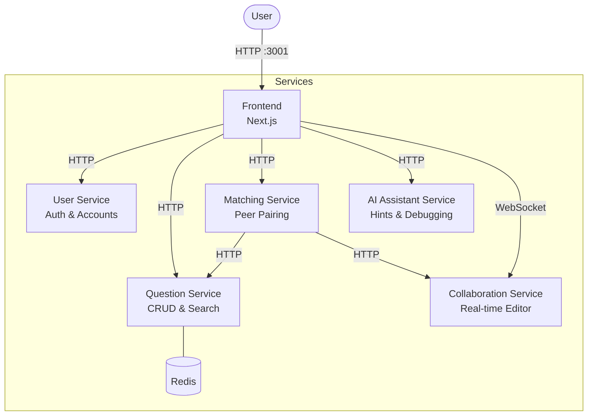

# PeerPrep

A technical interview preparation platform where students can find peers and practice whiteboard-style coding questions together in real time. Built with a microservices architecture.

## Architecture



| Service | Description |
|---|---|
| **Frontend** | Next.js web application |
| **User Service** | Authentication and user management |
| **Question Service** | Question bank with CRUD operations |
| **Matching Service** | Pairs users based on topic, difficulty, and language |
| **Collaboration Service** | Real-time collaborative code editing via WebSockets |
| **AI Assistant Service** | AI-powered hints, explanations, and debugging suggestions |

## Getting Started

### Prerequisites

- [Docker](https://www.docker.com/) and Docker Compose

### Environment Setup

Create the required environment/config files before running:

- `user-service/.env`
- `question-service/.env`
- `collaboration-service/.env`
- `ai-assistant-service/.env`
- `matching-service/application.properties`

Refer to each service's README for the expected variables.

### Run with Docker Compose

```bash
docker compose build
docker compose up -d
```

The app will be available at **http://localhost:3001**.

To stop all services:

```bash
docker compose down
```

### Recommended Frontend Development Workflow

For frontend development, the recommended workflow is to run the backend services in Docker, but run the Next.js frontend locally with hot reload.[1]

Why this was added:
- restarting the frontend container for every UI change is slow
- `npm run dev` gives Next.js Fast Refresh / hot reload
- browser console and local debugging are easier when the frontend runs directly on the host
- backend services can still stay containerized

To support this, the repo now includes a development-only Compose override file:

- `docker-compose.dev.yml`

This file publishes backend service ports to the host using the same localhost ports expected by `frontend/.env` and `frontend/.env.local`.[2][3]

#### Start backend services for local frontend development

```bash
docker compose -f docker-compose.yml -f docker-compose.dev.yml up -d
```

Then run the frontend locally:

```bash
cd frontend
npm install
npm run dev
```

Open the frontend at:

```text
http://localhost:3000
```

#### Why use two Compose files?

The base `docker-compose.yml` keeps service-to-service communication on the Docker network, which is the better default for containerized environments.

The `docker-compose.dev.yml` file is only for local development convenience. It publishes backend ports like `4001`, `8000`, `8080`, `4002`, and `1234` to the host so that a locally running frontend can call `localhost:*` URLs exactly as configured in the frontend env files.

This gives the best of both worlds:
- local frontend development stays fast
- backend services remain in Docker
- production-like/container-only setups do not need to expose every backend port by default

## Service Documentation

Each service has its own README with setup instructions, API details, and development guides:

- [Frontend](./frontend/README.md)
- [User Service](./user-service/README.md)
- [Question Service](./question-service/README.md)
- [Matching Service](./matching-service/docs/README.md)
- [Collaboration Service](./collaboration-service/readme.md)
- [AI Assistant Service](./ai-assistant-service/README.md)
