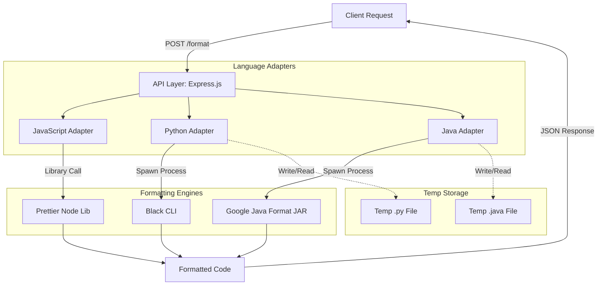

# Format Service

A stateless microservice that provides a unified API for code formatting across multiple programming languages (JavaScript, Python, Java).

## Architecture



The `format-service` is designed as a **stateless utility worker**. It abstracts away the complexity of managing different language-specific formatting engines behind a single HTTP interface.

### Core Components
- **API Layer:** Express.js providing a `POST /format` endpoint.
- **Language Adapters:** A uniform internal interface for executing different formatters:
    - **JavaScript:** Uses the `prettier` Node.js library.
    - **Python:** Spawns a subprocess to run `black`.
    - **Java:** Spawns a subprocess to run `google-java-format` (GJF) via the JVM.

## Software Engineering Principles

### 1. Single Responsibility Principle (SRP)
The service does exactly one thing: it takes raw code and returns formatted code. By isolating formatting logic into its own service, we avoid "runtime bloat" in other services (e.g., the `collaboration-service` doesn't need to have Python or Java installed).

### 2. Adapter Pattern
The service provides a unified interface (`POST /format`) for wildly different tools. The consumer doesn't need to know if the formatter is a native Node library or an external CLI tool; the internal logic handles the translation and execution details.

### 3. Resource Management & Cleanup
When executing CLI-based formatters (Python/Java), the service:
1. Generates a unique temporary file.
2. Executes the tool via `execFile`.
3. Ensures file deletion using `try...finally` blocks, preventing disk leaks.

### 4. Statelessness
The service maintains no database or session state. This makes it horizontally scalable; you can run multiple instances behind a load balancer without any coordination or data syncing.

## Design Decisions: Why this implementation?

| Choice | Rationale |
| :--- | :--- |
| **Microservice vs. Library** | Formatting engines (like `black` or `google-java-format`) require specific runtimes (Python, JVM). Wrapping these in a microservice containerizes these dependencies, keeping the rest of the system clean. |
| **Subprocesses (execFile) vs. Native Bindings** | Using `execFile` allows us to leverage the **official** formatting tools directly. While Wasm or native bindings might be faster, they are complex to maintain and often lag behind the official releases. |
| **Synchronous HTTP vs. Async Queue** | Code formatting is typically a sub-second task. Synchronous Request-Response is significantly simpler to implement and consume than an asynchronous message queue or polling system. |

## Library Selection Rationale

In building the `format-service`, we prioritized **opinionated** tools over **highly configurable** ones. This reduces "bikeshedding" (endless debates over code style) and ensures a consistent codebase regardless of who is writing the code.

### 1. JavaScript: Prettier
*   **Selected:** [Prettier](https://prettier.io/)
*   **Alternatives considered:** ESLint (formatting rules), Biome.
*   **Why Prettier over others?**
    *   **vs. ESLint:** ESLint is primarily a linter. Using it for formatting often leads to "rule hell" and conflicts with logic-based rules. Prettier's approach of re-printing the entire AST from scratch is more robust and requires zero manual configuration.
    *   **vs. Biome:** While Biome is faster, Prettier is the battle-tested industry standard with a much larger ecosystem of plugins and integrations, making it the safer choice for a long-term project.

### 2. Python: Black
*   **Selected:** [Black](https://github.com/psf/black)
*   **Alternatives considered:** `autopep8`, `yapf`.
*   **Why Black over others?**
    *   **vs. autopep8:** `autopep8` only fixes PEP8 violations but doesn't enforce a *consistent* visual style (e.g., it won't force a specific quote type or line-wrapping logic). Black ensures every Python file in the project looks identical.
    *   **vs. yapf:** `yapf` is highly configurable, which ironically defeats our goal. Configuration breeds "style wars" during PR reviews. Black's "uncompromising" (non-configurable) nature is its greatest feature.

### 3. Java: Google Java Format (GJF)
*   **Selected:** [google-java-format](https://github.com/google/google-java-format)
*   **Alternatives considered:** Checkstyle, IDE-internal formatters (Eclipse/IntelliJ).
*   **Why GJF over others?**
    *   **vs. Checkstyle:** Checkstyle is a linter that *reports* errors but doesn't automatically *fix* them in a deterministic way. GJF is an active formatter that ensures 100% compliance automatically.
    *   **vs. IDE Formatters:** Relying on IDEs leads to "diff wars" when an Eclipse user and an IntelliJ user edit the same file. GJF provides a **Single Source of Truth** that is independent of the developer's local environment.

## Getting Started

### API Endpoint
`POST /format`

**Request Body:**
```json
{
  "code": "def hello(): print('world')",
  "language": "python"
}
```

**Response:**
```json
{
  "formatted": "def hello():\n    print(\"world\")\n"
}
```

### Supported Languages
- `javascript` (via Prettier)
- `python` (via Black)
- `java` (via Google Java Format)
