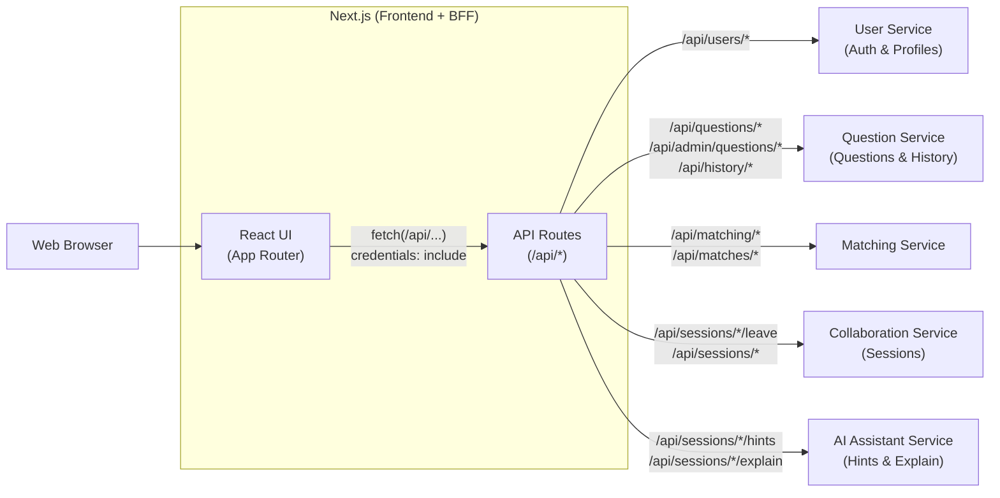

# PeerPrep Frontend

The PeerPrep frontend is built with [Next.js](https://nextjs.org) (App Router), [TailwindCSS](https://tailwindcss.com), and [shadcn/ui](https://ui.shadcn.com).

## Architecture



**Auth flow:** The User Service issues a JWT inside an httpOnly cookie on login. The browser automatically includes this cookie on every request. Each API route in the BFF layer forwards the cookie and authorization headers to the upstream microservice using `forwardAuthHeaders()`, so individual services can verify the user's identity without the browser ever touching the raw token.

---

## Getting Started

```bash
npm run dev
```

Open [http://localhost:3000](http://localhost:3000) to view it in the browser.

## Testing

Install browser binaries for Playwright once after pulling the repo:

```bash
npm run test:e2e:install
```

Run the unit and component tests with Jest:

```bash
npm test
```

Watch Jest tests during development:

```bash
npm run test:watch
```

Generate a Jest coverage report:

```bash
npm run test:coverage
```

Run the Playwright smoke tests:

```bash
npm run test:e2e
```

Open the Playwright UI runner:

```bash
npm run test:e2e:ui
```

---

## Tech Stack

| Technology | Purpose |
|---|---|
| **Next.js** (App Router) | Framework — pages, layouts, and API routes |
| **TailwindCSS** | Utility-first styling |
| **shadcn/ui** (`new-york` style) | Pre-built UI components (buttons, cards, dialogs, etc.) |

---

## UI Components

All UI components come from **shadcn/ui**. They live in `components/ui/`.

To add a new component:

```bash
npx shadcn@latest add <component-name>
```

Don't create custom primitives (buttons, inputs, forms, etc.) when shadcn already has one — just use it and compose your page from there.

---

## Styling & Colors

Our theme colors are defined via CSS variables in `app/globals.css`. You can use them in your markup through Tailwind classes:

| What you need | Tailwind class |
|---|---|
| Page background | `bg-background` |
| Default text | `text-foreground` |
| Primary buttons / CTAs | `bg-primary text-primary-foreground` |
| Secondary surfaces | `bg-secondary` |
| De-emphasized text | `text-muted-foreground` |
| Accents & highlights | `bg-accent text-accent-foreground` |
| Danger / delete actions | `bg-destructive` |
| Cards | `bg-card text-card-foreground` |
| Borders | `border-border` |
| Input borders | `border-input` |
| Focus rings | `ring-ring` |
| Charts | `text-chart-1` … `text-chart-5` |
| Sidebar | `bg-sidebar`, `text-sidebar-foreground`, etc. |

If you need a color that isn't in the theme, use a standard Tailwind color class (e.g. `text-emerald-500`, `bg-slate-100`).

> **Do not** use raw CSS for colors or styling — no inline `style={{ ... }}` or custom CSS rules. Stick to Tailwind classes.

---

## Calling Backend Services (BFF Pattern)

Frontend components **never call microservices directly**. Instead, they go through Next.js API routes, which act as a Backend-for-Frontend (BFF) proxy layer:

```
Browser  →  /api/questions  →  Next.js API Route  →  Question Service (internal)
```

This keeps service URLs and secrets server-side, avoids CORS issues, and gives us a single place to attach auth tokens and handle errors.

### Step 1 — Client Component

In your page or component, call the local `/api/...` endpoint:

```tsx
"use client";

import { useEffect, useState } from "react";

export default function QuestionsPage() {
  const [questions, setQuestions] = useState<Question[]>([]);
  const [loading, setLoading] = useState(true);

  useEffect(() => {
    async function fetchQuestions() {
      try {
        const res = await fetch("/api/questions");
        if (!res.ok) throw new Error("Failed to fetch");
        const data = await res.json();
        setQuestions(data);
      } catch (error) {
        console.error("Error loading questions:", error);
      } finally {
        setLoading(false);
      }
    }
    fetchQuestions();
  }, []);

  // render your UI ...
}
```

### Step 2 — API Route

The API route (`app/api/questions/route.ts`) proxies the request to the actual microservice:

```typescript
import { NextRequest, NextResponse } from "next/server";

const QUESTION_SERVICE_URL = process.env.QUESTION_SERVICE_URL ?? "http://localhost:3001";

export async function GET(request: NextRequest) {
  try {
    const { searchParams } = request.nextUrl;
    const res = await fetch(`${QUESTION_SERVICE_URL}/questions?${searchParams}`, {
      headers: {
        Authorization: request.headers.get("Authorization") ?? "",
      },
    });
    const data = await res.json();
    return NextResponse.json(data, { status: res.status });
  } catch {
    return NextResponse.json({ error: "Question service unavailable" }, { status: 503 });
  }
}
```

---

## Learn More

- [Next.js Docs](https://nextjs.org/docs)
- [TailwindCSS Docs](https://tailwindcss.com/docs)
- [shadcn/ui Docs](https://ui.shadcn.com)
