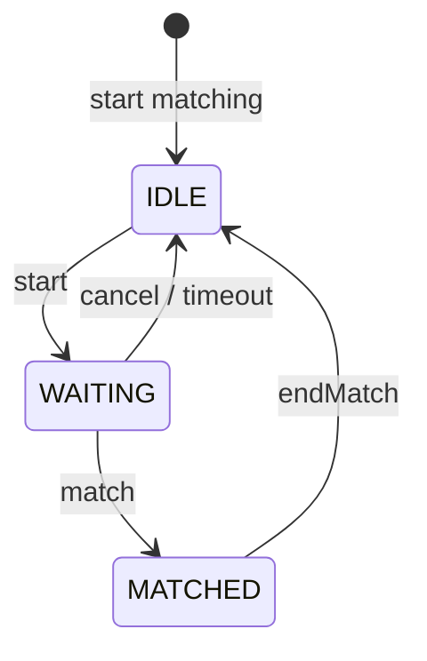

# Matching Service

## Overview

Matching service matches users by their selected topic, language, and difficulty in real-time. Matching prioritises strict preference pairing and falls back to relaxed difficulty when necessary. Users are automatically timed out if they do not match within 2 minutes.

## Tech Stack
- **Spring Boot** - matching service, workers, REST APIs
- **Redis** - queues, user state, and atomic matchmaking (Lua scripts)
- **MongoDB** - persistent storage for match metadata
- **Docker** - orchestration 

## Quick Start:
Set appropriate values in ```application.properties```. Refer to ```application.properties.example``` as template.

### Run with Gradle
```./gradlew bootrun```

### Run with Docker
```
docker build -t matching-service .
docker run -p 8080:8080 -e SPRING_DATA_MONGODB_URI="mongodb://..." matching-service
```

## API endpoints:

| Action       | HTTP Method | Endpoint                         |
| ------------ | ----------- | -------------------------------- |
| Start        | POST        | `/matching/requests`             |
| Cancel       | DELETE      | `/matching/requests/[RequestId]` |
| Status       | GET         | `/matching/requests/[RequestId]` |
| End Match    | DELETE      | `/matches/[MatchId]`             |

## Matching System Design

### Queue Structure (Redis ZSET)

```
queue:{topic}:{language}:{difficulty}
```

Example:

```
queue:Arrays:python:Easy
```

### User state flow:



### Matching Strategy
- Strict Matching
    - Same difficulty pairing:
        - EASY-EASY
        - MEDIUM-MEDIUM
        - HARD-HARD
- Relaxed Matching
    - Adjacent difficulty pairing: 
        - EASY ↔ MEDIUM
        - MEDIUM ↔ HARD
- Lua Script Guarantees
    - Atomic dequeue + state update
    - Prevents double matching

### Matching Worker Flow
1. Polls Redis dirtyScopes
2. Processes scope: ```topic:language```
3. Runs:
    - Strict match loop (cap 10)
    - Relaxed match loop (cap 3)
4. Re-adds scope if queue still has users

## Debugging Tools
Redis CLI
```
redis-cli
```

Inspect queues
```
KEYS queue:*
ZRANGE queue:<topic>:<language>:<difficulty> 0 -1 WITHSCORES
```

Inspect user state
```
HGETALL userState:<userId>
```

Check dirty scopes
```
SMEMBERS dirtyScopes
```

## Development Notes
- Matching runs every 100ms via scheduled worker
- Timeout runs every 500ms via scheduled worker
- Redis ZSET used for ordering by join timestamp
- Lua scripts ensure atomic match operations
- Dirty scope system triggers reprocessing when queue changes
- Rollback worker handles failed match finalisation and re-queues users 