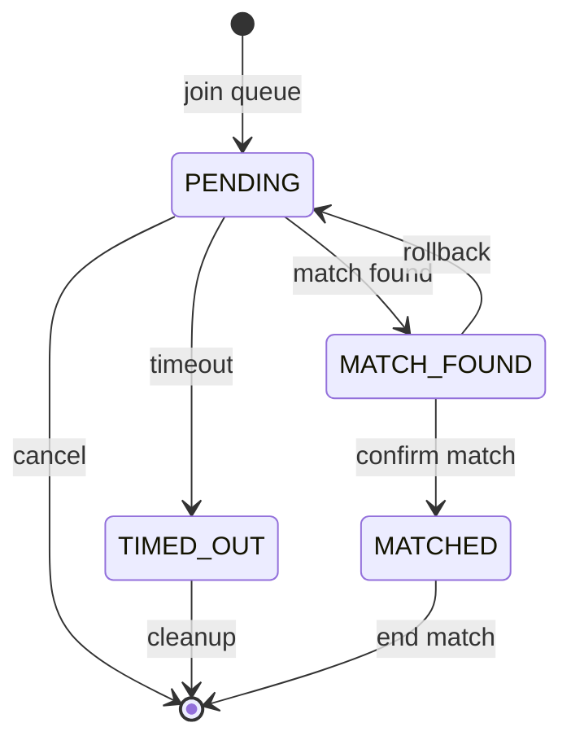

# Matching Service

## Overview

Matching service matches users by their selected topic, language, and difficulty in real-time. Matching prioritises strict preference pairing and falls back to relaxed difficulty when necessary. Users are automatically timed out if they do not match within 2 minutes.

## Tech Stack
- **Spring Boot** - matching service, workers, REST APIs
- **Redis** - queues, user state, and atomic matchmaking (Lua scripts)
- **MongoDB** - persistent storage for match metadata
- **Docker** - orchestration 

## Quick Start:
Set appropriate values in ```application.properties```. Refer to ```application.properties.example``` as template.

### Run with Gradle
```./gradlew bootrun```

### Run with Docker
```
docker build -t matching-service .
docker run -p 8080:8080 -e SPRING_DATA_MONGODB_URI="mongodb://..." matching-service
```

## API endpoints:

| Action       | HTTP Method | Endpoint                         |
| ------------ | ----------- | -------------------------------- |
| Start        | POST        | `/matching/requests`             |
| Cancel       | DELETE      | `/matching/requests/[RequestId]` |
| Status       | GET         | `/matching/requests/[RequestId]` |
| End Match    | DELETE      | `/matches/[MatchId]`             |

## Matching System Design

### Queue Structure (Redis ZSET)

```
queue:{topic}:{language}:{difficulty}
```

Example:

```
queue:Arrays:python:Easy
```

### User state flow:



### Matching Strategy
The system supports a two-tier matchmaking model to balance fairness and queue latency.

#### Strict Matching
> Pairs users with identical difficulty levels:
>
> - EASY-EASY
> - MEDIUM-MEDIUM
> - HARD-HARD
> 
> This ensures fair skill-based matching.

#### Relaxed Matching
> Allows cross-difficulty pairing when strict matches are insufficient:
> 
> - EASY ↔ MEDIUM
> - MEDIUM ↔ HARD
> 
> Eligibility constraint:
> - Users must have been in queue for ≥ 20 seconds before they are eligible for relaxed matching
>
> This improves queue throughput and reduces wait time while maintaining reasonable skill proximity.

#### Lua Script Guarantees

Lua scripts handle all critical lifecycle operations under concurrency:
- User add / cancel / timeout / matching

Guarantees
- Atomic execution of multi-key operations
- Prevents race conditions and double matching
- Ensures consistent state transitions across Redis structures
- Eliminates partial updates

### Matching Worker Flow
1. Polls Redis dirtyScopes
2. Processes scope: ```topic:language```
3. Runs:
    - Strict match loop (max 10 iterations)
    - Relaxed match loop (max 3 iterations)
4. Re-adds scope if queue still has users

## Redis Data Structures
### 👤 User State
```
userState:{userId} → Hash
```
Fields:
- userId
- requestId
- userName
- state (PENDING / MATCH_FOUND / MATCHED / TIMED_OUT)
- topic
- language
- difficulty
- joinTime

### 📊 Matchmaking Queues
```
queue:{topic}:{language}:{difficulty} → Sorted Set
```
- member: userId
- score: joinTime
- used for FIFO-style matching

### ⏱️ Timeout Tracking
```
timeout:queue → Sorted Set
```
- member: userId
- score: expiryTime

### 🔗 Request Mapping
```
requestUser:{requestId} → userId
```
```
userRequest:{userId} → requestId
```

### 🤝 Match Finalization & Lifecycle Tracking

This section tracks the state of matches after they are found, including finalization, retries, and rollback safety.

#### 🧾 Pending Finalizations
```
pendingFinalizations → Set
```
- member: "userId1:userId2"
- tracks matches awaiting final confirmation
- serves as a reconciliation queue for retrying failed finalization

#### 🔁 Match Found Tracking (Rollback Safety)
```
matchFoundUsers → Set
```
- member: userId
- users currently in MATCH_FOUND state
```
matchFoundAt:{userId} → timestamp
```
- time when user entered MATCH_FOUND
- used for rollback decisions

#### 🔗 Match Resolution Mapping
```
userMatch:{userId} → matchId
```
- maps user → matchId
- used to for rollback lookup

#### 🔔 Collaboration Notification Guard
```
collabNotified:{matchId} → String ("true" | "false")
```
- indicates whether collaboration service has been notified
- acts as a finalization checkpoint

#### ♻️ Rollback & Retry Rules
If collabNotified = false:
- match is safe to rollback
- users can be requeued

If collabNotified = true:
- match is considered externally visible
- rollback is disabled
- only retry finalization is allowed

## MongoDB Data Structures
Stores persistent match history after completion.
```
@Document(collection = "matches")
public class MatchDoc {
    @Id
    private String id;

    @Indexed(unique = true)
    private String matchId;
    
    private String user1;
    private String user2;
    private String status;  // "active" or "ended"
    private String questionSlug;
    private Date createdAt;
    private Date endedAt;
}
```

## Debugging Tools
Redis CLI
```
redis-cli
```

Inspect queues
```
KEYS queue:*
ZRANGE queue:<topic>:<language>:<difficulty> 0 -1 WITHSCORES
```

Inspect user state
```
HGETALL userState:<userId>
```

Check dirty scopes
```
SMEMBERS dirtyScopes
```

## Development Notes
- Matching runs every 100ms via scheduled worker
- Timeout runs every 5000ms via scheduled worker
- Redis ZSET used for ordering by join timestamp
- Lua scripts ensure atomic match operations
- Dirty scope system triggers reprocessing when queue changes
- Rollback worker handles failed match finalisation and re-queues users 