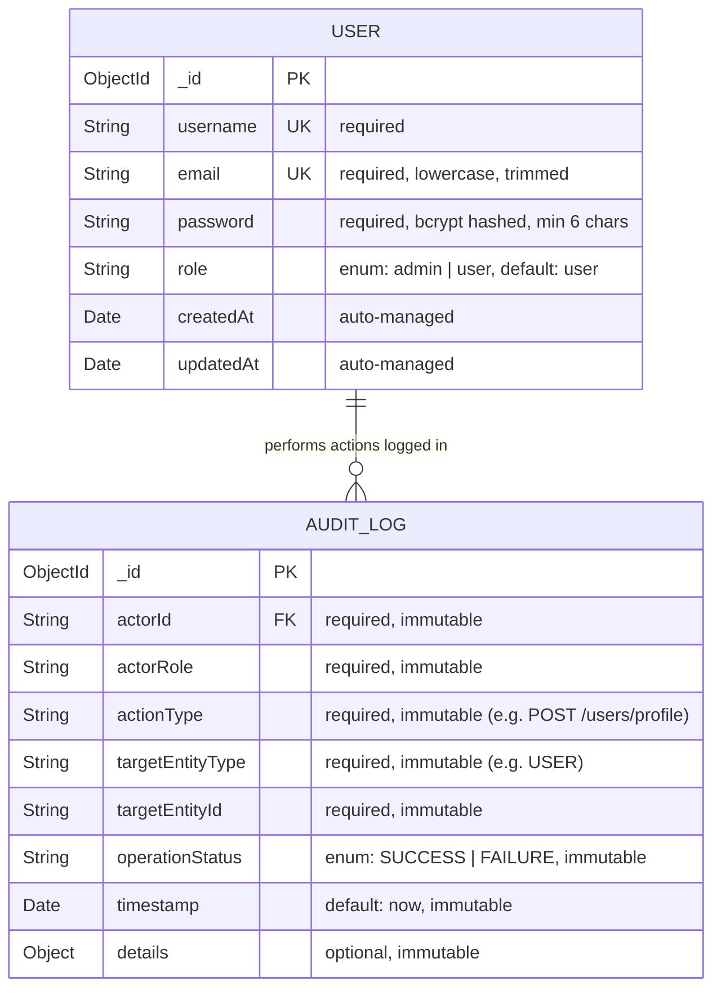
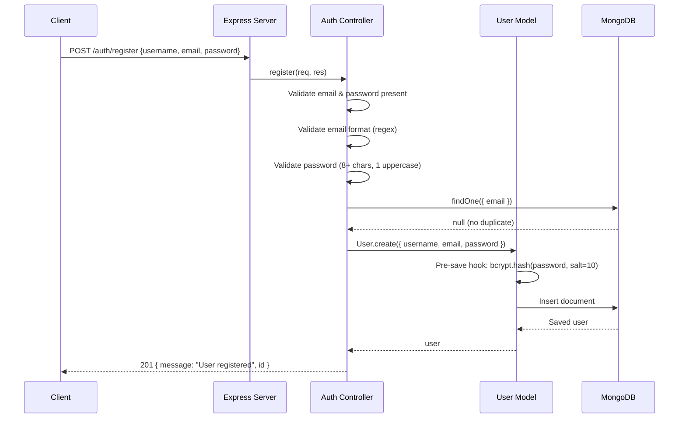
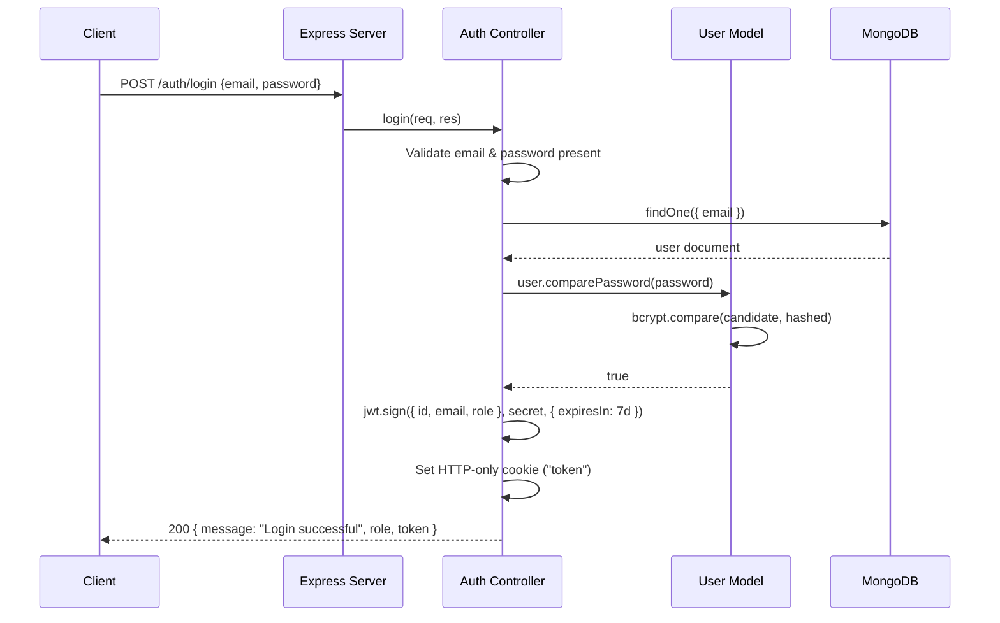
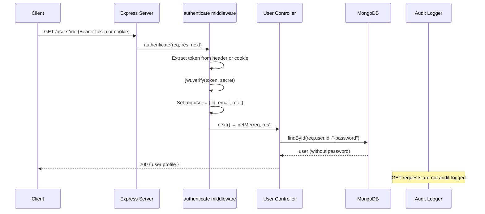
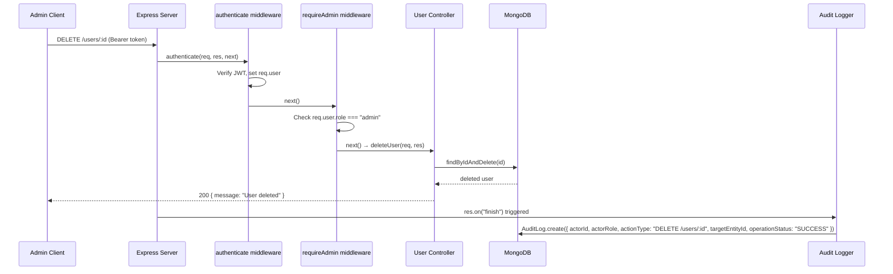
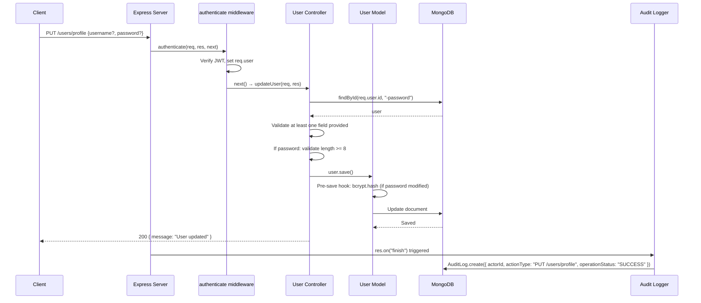
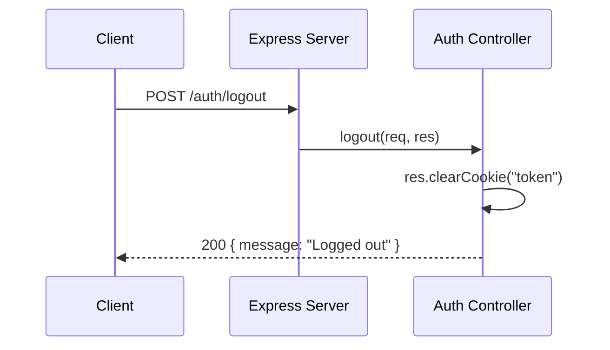

# User Service Diagrams

## Entity-Relationship Diagram

## Sequence Diagrams

### 1. User Registration

### 2. User Login

### 3. Accessing a Protected Endpoint (Get Profile)

### 4. Admin Deletes a User

### 5. Update Profile

### 6. Logout

